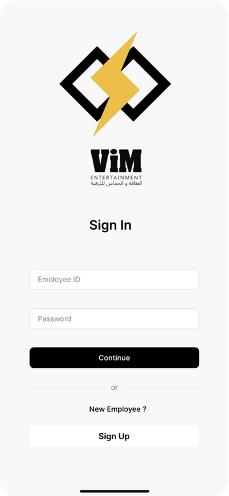
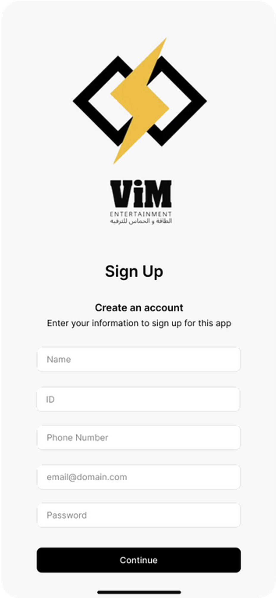
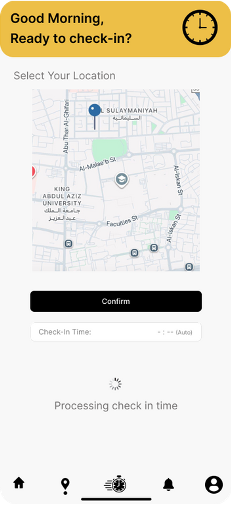
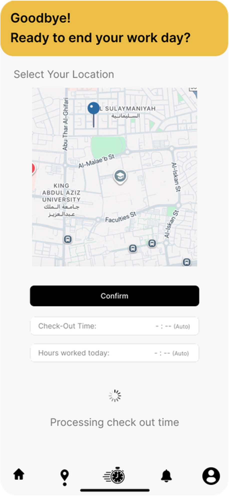
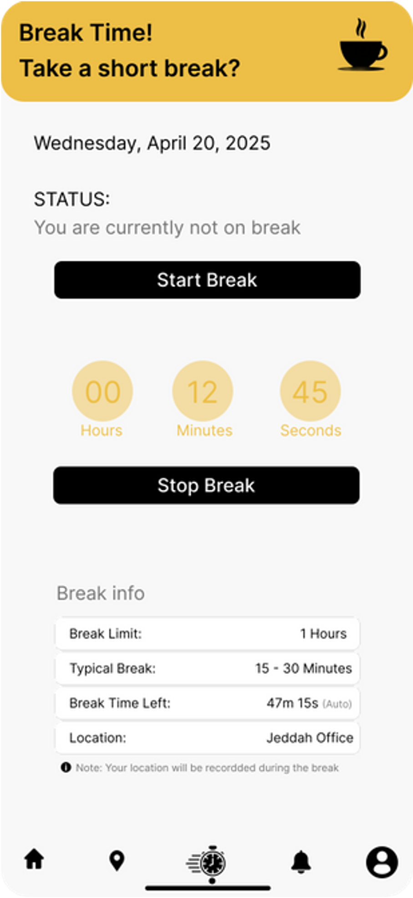
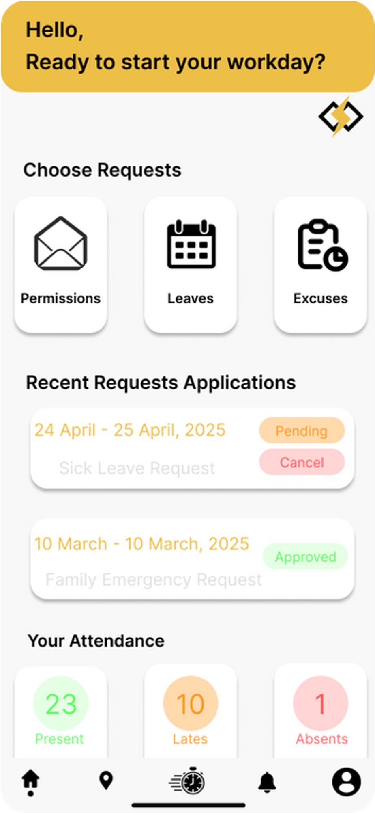
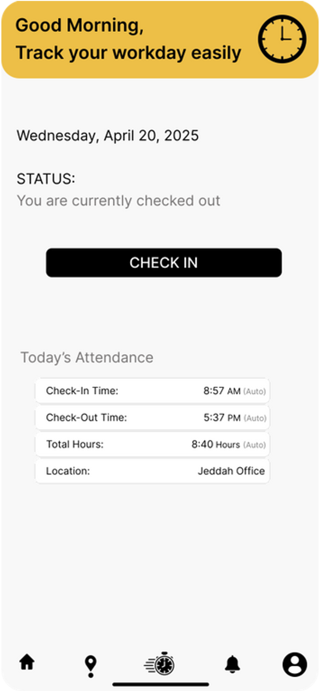

# Mobile Attendance Tracking System

A university team project designed to improve attendance management for field employees through a mobile application integrated with ERPNext. The system enables GPS-based attendance tracking, employee requests, and role-based access for managers and HR.

---

## Project Overview

The Mobile Attendance Tracking System was designed to solve the challenge of tracking attendance for employees who work outside the office. Instead of relying on traditional fingerprint devices, employees can use a mobile application to record their attendance using GPS verification.

---

## Features

- GPS-based Check-in and Check-out
- Attendance Recording
- Break Time Tracking
- Employee Requests
  - Absence
  - Sick Leave
  - Late Arrival
  - Early Leave
- HR & Manager Approval Workflow
- ERPNext Integration

---
## User Interface

### Login

### Registration

### Home

### Check In

### Check Out

### Break

### Request

### Status

---

## System Diagrams📊

- Context Diagram
- Data Flow Diagram (Level 1 & Level 2)
- Use Case Diagram
- Activity Diagram
- Sequence Diagram
- Class Diagram
- State Diagram
- Entity Relationship Diagram (ERD)

---

## Database🗄️

The repository includes:

- Database Schema
- DDL Scripts
- DML Scripts
- SQL Join Queries
- Aggregate Functions

---

## Team Project

This project was developed as part of a university team project.

My contributions included system analysis, requirements engineering, UML modeling, database design, and user interface design.

---

## License

This project is shared for educational and portfolio purposes.
